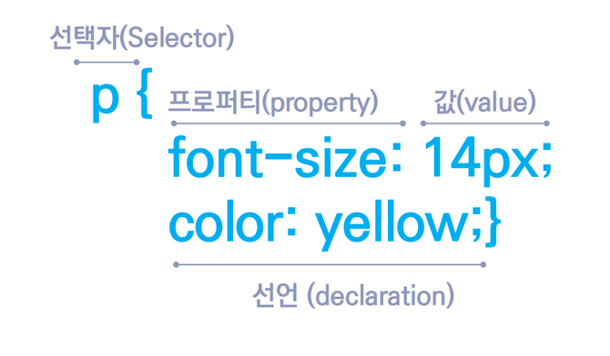

# CSS


## 1. CSS란?
- **Cascading Style Sheets**의 약자로 우선순위를 파악할 수 있다
<div align="center">
    
</div>

- CSS3, CSS4는 없다?!
    - CSS 2.1 개발이 완료되고 CSSWG(CSS Working Group)는 더 이상 CSS의 버전을 3, 4와 같은 메이저 업데이트로 가져가지 않기로 결정했기 때문!  

- CSS 기능의 단위를 모듈(module)이라고 표현한다

### CSS의 기본 구조  
<div align="center">
    
</div>

## 2. CSS 적용
- 인라인, 내부, 외부, 다중(@import)

## 3. reset css
- 에릭 마이어의 reset CSS
- normalize.css (오늘날 가장 많이 사용하는 reset css)

## 4. 주석 및 벤더프리픽스
- `/* 주석은 이렇게 사용합니다. */`
- 벤더프리픽스 : 벤더(브라우저 제조사)와 프리픽스(접두어)의 합성어
- https://autoprefixer.github.io/ : VSC에도 익스텐션으로 있음
- 회사에서 사용하는 prefixer가 있거나 컨벤션이 정해져 있을 것

## 5. 선택자 우선순위
1. 후자 우선의 원칙 : 동일한 선택자가 연속으로 사용되었을 경우 후자가 우선
2. 구체성(명시도)의 원칙 : 한 선택자가 다른 선택자보다 더 구체적(Specificity)으로 작성되어있다면 적용
    ```css
    h1.one { 
        /* 이걸 적용함 */
        color: blue;
    }
    h1 {
        color: red;
    }
    ```
3. 중요성의 원칙 


- https://specificity.keegan.st/   
- !important

## 6. CSS Box Model
- 우리가 실습한 display
```css
    display: block;
    display: inline;
    display: inline-block;
    display: flex;
    display: gird;
```
- block
    - width, height로 조절 가능
    - margin, padding, border 사용 가능
- inline
    - width, height 사용 불가
    - padding, border 사용 가능
    - margin은 좌우만 조정 가능
- inline-block 
    - 인라인 요소의 특성(한 줄에 여러 요소 존재)을 가지면서 블록 요소의 특성(width, height, margin, padding 등 모든 값을 지정할 수 있음)
- border
    - 네 개의 값 모두 사용 가능
    - `radius` 속성으로 테두리의 꼭짓점을 둥글게 만들 수 있음
- padding(단축 속성)
    - 2개 : 10px 15px (상하, 좌우)
    - 3개 : 10px 15px 20px (상, 좌우, 하)
    - 4개 : 10px 15px 20px 25px (상, 우, 하, 좌)

- 대체 박스 모델 (Alternative CSS Box Mode)
    - `box-sizing: border-box`

    ## 7. CSS declarations
    - 단위
        - 절대 길이 단위 : px 등
        - 상대 길이 단위 : em, rem, vw, vh, % 등
    - background-image
        ```css
        .home-header {
            background-image: url("apple.jpg");
            background-size: cover;
            background-position: 50% 50%;
            /* background-position: center center; */
            background-repeat: no-repeat;
        }
        ```
- font 
    - font-size 
    - font-family
        - web font를 link를 이용하여 지정 가능하다
    - font-weight
    - font-align
    - text-decoration
        - ul태그 같은 리스트의 맨 앞에 붙은 bullet 기호는 `list-style-type: none`로 없앨 수 있다
        - 앵커태그의 밑줄은 `text-decortion: none`을 사용하여 제거할 수 있다
- color
    - 표기 방법: red, #000, #000000, rgb(0, 0, 0), rgba(100, 100, 100, 0.3), transparent  
- text 

## 8. position
- position: static
- position: relative
- position: absolute
- position: sticky
- position: fixed
- z-index 
    - 값을 10 단위로 주는 것을 권고함
- float 
    - IE를 지원하는 경우에 많이 사용함

## 10. CSS selector 심화
- 헷갈리는 선택자
    - `h1.one` : one 클래스를 가진 h1 
    - `h1 .one` : 부모인 h1 자손 중에 one 클래스를 가진 요소
    - `h1 > .one` : 부모인 h1 자식 중에 one 클래스를 가진 요소
    - `h1 + ul` : h1 직후에 있는 ul태그(인접 형제)
    - `h1 ~ ul` : h1 태그 뒤에 있는 모든 ul태그(형제)

- 가상 클래스 선택자(:)
    - 예전에 구형 브라우저 대응을 위해 가상 클래스 선택자에 ::를 사용했는데 이제는 사용하지 말기
    - e.g. `.foo:nth-child(3)`, `.foo:nth-child(2n)`
    - hover
        - e.g. `.foo:hover`
- 가상 요소 선택자(::)
    - e.g. `.foo::before`
    - `.foo::after`

## 11. flex and grid
**아래 코드(flex 중앙정렬)은 외우는 것을 추천!**
### flex
```html
<style>
    .container {
        display: flex;
        justify-content: center;
        align-items: center;
    }

    .item {
        width: 100px;
        height: 100px;
        border: 1px solid black;
    }
</style>
<body>
    <div class="container">
        <div class="item">1</div>
        <div class="item">2</div>
        <div class="item">3</div>
        <div class="item">4</div>   
    </div>
</body>
```
- gap은 IE에서 사용 못함

### grid
```css
    .container {
        display: grid;
        grid-template-columns: repeat(2, 1fr);
    }

    .item {
        width: 100px;
        height: 100px;
        border: 1px solid black;
    }
```
- 요새 많이 사용하는 방법 🔽
```css

```
