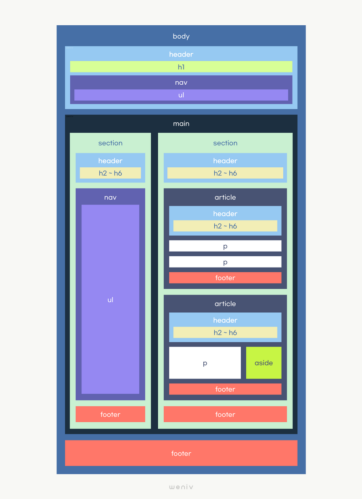
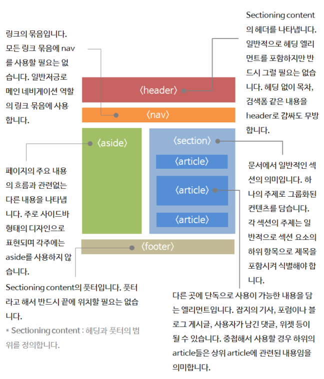
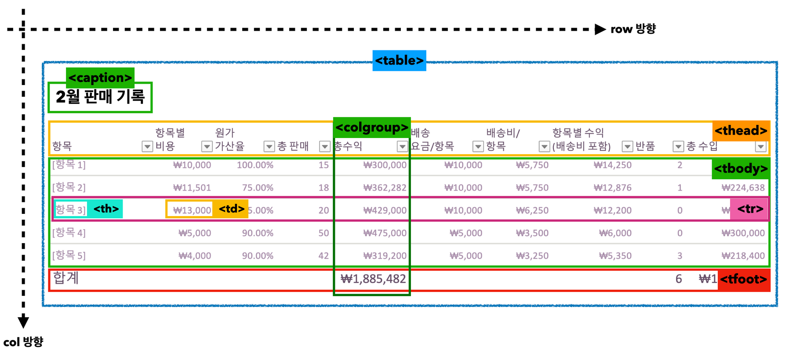

# HTML

## 1. HTML이란?

웹에서 문서를 표현하기 위한 방법

## 2. HTML 표준

-   [HTML living standard](https://html.spec.whatwg.org/multipage/)
-   리빙스탠다드 안에 MDN 문서가 같이 있다. 따라서 MDN를 보셔도 좋다.

## 3.HTML 요소

-   시작태그(start tag(O), opening tag), 종료태그(end tag(O), closing tag) - h1, p
-   빈태그(void tag, empty tag)

## 4. The elements of HTML

### The document element

-   html element

### Document metadata

-   head
-   title
-   base
-   link
-   meta
    - https://developer.twitter.com/en/docs/twitter-for-websites/cards/overview/abouts-cards
    - https://ogp.me/
-   style

### Sections
  

출처 : 제주코딩베이스캠프

-   body
-   article
    - heading 요소를 반드시 포함해야 한다
    - 독립해서 볼 수 있다(컨텐츠와 관련있어야 하고, section과도 관련있어야 한다)
-   section
    - heading 요소를 반드시 포함해야 한다
    - 범용적인 묶음 목적으로 사용한다(컨텐츠와 관련있어야 한다)
-   nav
-   aside
    - 광고, 위젯 등 콘텐츠와 연관성이 떨어지는 콘텐츠의 집합이다
-   h1, h2, h3, h4, h5, h6
-   hgroup
    - 문서 구획을 할 때 2차 제목을 연결한다
    - 주의 사항 : hgroup은 이론적으로만 유효 -> [MDN 문서 참고](https://developer.mozilla.org/ko/docs/Web/HTML/Element/hgroup)
-   header
    - 콘텐츠의 시작 부분을 나타내는 요소(구역의 제목을 포함하는 용도로 많이 사용한다)
    - h1 > a > img (다음)
    - h1 > a (네이버)
    - h1(screen out-ir기법으로 날림) + img 
-   footer
    - 작성자 정보, 저작권, 관련된 링크 등의 내용을 담는 구획
-   address
    - 주소 정보 등을 담는다.

### Grouping content

-   p
-   hr
    - 브라우저마다 보여지는 화면이 달라서 은행권 같은 곳에서는 사용을 지양한다(실무에서 은행권은 border나 이미지를 사용한다)
-   pre
    - 공백을 병합하고 싶지 않을 때 사용(코드 그대로 출력됨) -> 이게 필요한 이유는? html 특성상 공백을 병합하기 때문
-   blockquote
    - 인용블록
    - 참고 : q는 인용구(주로 문장 안에 사용)
-   ol
    - 순서가 있는 목록
    - type이 있다. i, I, 1, a, A..  
       e.g. `<ol type="I"><li></li></ol>`
-   ul
-   menu
-   li
    - `<ol>`, `<ul>` 의 직계 자식 요소로는 `<li>` 요소만 사용된다(즉, `<ol>`, `<ul>` 요소 안에서만 사용되어야 한다)
-   dl
    - 정의 목록
    - 보통 dl > div > dt > dd
    - json의 key와 value의 쌍을 읽어올 때에도 사용한다
-   dt
    - 정의할 용어
-   dd
    - dt 용어 설명
-   figure
-   figcaption
    - 이미지와 함꼐 콘텐츠의 캡션이 연결되도록 사용
        ```html
        <figure>
            
            <figcaption>
                관심 받고싶어하는 아기
            </figcaption>
        </figure>
        ```
-   main
    - 주요 콘텐츠가 담겨져 있는 곳
    - IE에서는 지원하지 않는 비교적 최근에 등장한 요소임으로 주의가 필요하다 (하지만 css에서 태그를 만지면 사용은 가능)
-   div
    - 최후의 수단으로 활용을 권장하지만 실무에서는 이상과 현실의 괴리가 있을 수 있다.

### Text-level semantics

-   a
    - a태그 내부에 block 요소 삽입이 가능하다(HTML5부터)
    - html 문법상 sections, grouping content 요소들은 텍스트 레벨 요소의 자식으로 사용되지 않지만, 앵커 태그만 예외적으로 sections, grouping content 요소를 자식으로 하는것이 허용됨
    - 사용자와 인터렉션이 가능한 요소를 자식으로 두지 않기 때문에 주의가 필요하다  
         - e.g. 잘못된 문법
            - `a > a`
            - `a > button`
-   em
    - 스크린리더가 강조해서 읽는다
    - 강조의 의미가 있다
-   strong
    - 스크린리더가 강조해서 읽는다
    - strong를 중첩해서 의미를 더욱 강조할 수도 있다
-   small
-   s
-   cite
-   q
-   dfn
    - 현재 문맥에서 정의하고 있는 용어 
-   abbr
    - 준말
-   ruby
-   rt
-   rp
-   data
-   time
-   code
-   var
-   samp
-   kbd
-   sub and sup
    - `<sub` : 아랫첨자
    - `<sup>` : 윗첨자
        ```html
        <p>H<sub>2</sub>0</p>
        <p>x<sup>2</sup>=4</p>
        ```
-   i
    - 기울임 글꼴
-   b
    - 글씨 굵게(시맨틱 의미 없음)
-   u
-   mark
-   bdi
-   dbo
-   span
    - where pharsing content is ecpected(파싱 콘텐츠가 예상되는 곳)
    - phrasing content : Phrasing content is the text of the document, as well as elements that mark up that text at the intra-paragraph level.
-   br
    - 줄바꿈
-   wbr
    - 줄바꿈(텍스트 박스에서 한 줄로 모두 표시가 안될 때에만 줄바꿈이 일어남)

### Embedded content

-   picture
    - 각기 다른 디스플레이 조건에 맞는 이미지를 보여주는 요소이다
-   source
-   img
    - img에 width, height를 직접 코딩하는 것을 권고하지 않는다 -> CSS 영역으로 넘어간다
    - alt 같은 경우 스크린리더가 어떻게 읽는지 파악하고 있어야 한다 
        - alt가 비어있는 경우(`alt=""`) : 읽지 않고 넘어간다 
        - alt가 속성 자체가 없는 경우 : 파일명을 읽는다 
-   iframe
    - 사용할 때 보안 권고사항을 준수하기(개발 요구사항이나 회사 코딩 컨벤션의 보안 관련 부분을 꼭 참고하기)
    - (유튜브 외의 콘텐츠를 불러왔을 때) iframe 코드에 해킹코드가 삽입되어 있는 등 보안에 취약하여 공격받을 수 있는 여지가 많아 사용에 주의해야 한다
-   embed
-   video
-   audio
-   track
-   map
    - `<area>` 요소와 함께 이미지 맵(클릭 가능한 링크 영역)을 정의할 때 사용한다
        ```html
        <div class="intro_img">
            
            <map name="secret">
                <area
                    href="./jejuoncoding.html"
                    target="_blank"
                    alt="jejucoding"
                    shape="rect"
                    coords="500, 300, 750, 600"
                />
            </map>
            <div class="intro_saying">"디딤돌, 전환점이 되어 드리겠습니다."</div>
        </div>
        ```
-   area
-   Tabular data
-   table  
      
    ```html
    <table>
        <caption>
            제목이나 설명(사용을 권고합니다.)
        </caption>
        <colgroup>
            <!-- 한 열에 공통적인 스타일 -->
            <col class="구분" />
            <col class="이름" />
            <col class="판매량" />
        </colgroup>
        <thead>
            <tr>
                <th>구분</th>
                <th>이름</th>
                <th>판매량</th>
            </tr>
        </thead>
        <tbody>
            <tr>
                <td>1</td>
                <td>해리포터</td>
                <td>100</td>
            </tr>
            <!-- ...생략... -->
        </tbody>
        <tfoot>
            <tr>
                <td colspan="2">총 판매량</td>
                <td>600</td>
            </tr>
        </tfoot>
    </table>
    ```
    - `<thead>`, `<tbody>`, `<tfoot>` 기억하자!
        - 특히 `<thead>` 꼭 넣어주기
-   caption
    - 제목이나 설명(사용을 권고함!)
-   colgroup
    - 한 열에 공통적인 스타일
-   col
-   tbody
-   thead
-   tfoot
-   tr
-   td
-   th

### Forms

-   form
    ```html
    <form action="./test.html" method="get">
        <lable for="id">아이디</lable>
        <input type="text" name="아이디" id="id" /><br />
        <lable for="pw">패스워드</label>
        <input type="password" name="패스워드" id="pw" /><br />
        <button type="submit">로그인</button>
    </form>
    ```
    - 위 코드의 form을 제출했을 경우 `test.html?아이디=hello&패스워드=world`의 형태로 들어감
    - GET 방식 vs POST 방식
        - GET : URL로 데이터를 전달할 때 사용(file같은 큰 파일은 get으로 전송하지 않습니다. id와 pw같은 민감데이터 x)
        - POST : 패킷안에 데이터를 넣어 전달할 때 사용한다. (민감데이터 O, 큰데이터 O)
-   label
-   input
-   button
-   select
-   datalist
-   opstgroup
-   option
-   textarea
-   output
-   progress
-   meter
-   fieldset
-   legend
-   Interactive elements
-   details
-   summary
-   dialog

## 5. emmet 자동완성
- 자주 사용되는 emmet 문법
```
h1
h1+h2+p
h2*3
h1{hello world}*10
h1#hojun
h1.hoju
(div>table>(tr>(td*2))*3)+(footer>p)
div#one.c1.c2.c3
ul>li.item$*5
table>(tr#id$>td.class$*6)*3
a{Click}
lorem
img:z
<!-- lorem*5는 5개의 문장 -->
lorem*5
<!-- lorem5는 5개의 단어 -->
lorem5
[a='value1' b="value2" c=1]
a[href='www.naver.com']
```
- emmet cheat sheet  
[참고자료](https://docs.emmet.io/cheat-sheet/) 

## 6. 참고사항
- picture, source, img
    - WebP(웹피, 2010년 구글에서 만든 이미지 포맷)
    - 용량이 적고, 투명도를 표현할 수 있다
    - 대신, 브라우저에 따라 호환성이 안되는 경우도 있어 대체 이미지를 같이 넣어주는게 좋다
    - 이미지 확장자별 투명도 표현 유무
        - jpg : 투명도 표현 X
        - png : 투명도 표현 O   
        - source(=src) : 해상도에 맞는 이미지를 선택해서 해당 이미지를 불러준다
        - source > srcset : 여러 해상도에 대응하는 이미지 셋으로 구성할 수 있다
        - source > mdeia : 조건에 알맞는 이미지를 찾는다

- form 
    - checked : 체크상태 표시
    - required : 필수값
    - min : 최솟값
    - max : 최댓값
    - value : 입력된 값
    - placeholder : 입력값 힌트
    - minlength : 최소 길이
    - maxlength : 최대 길이
    - autocomplete : 브라우저 제공 자동완성(사용할지 안할지)